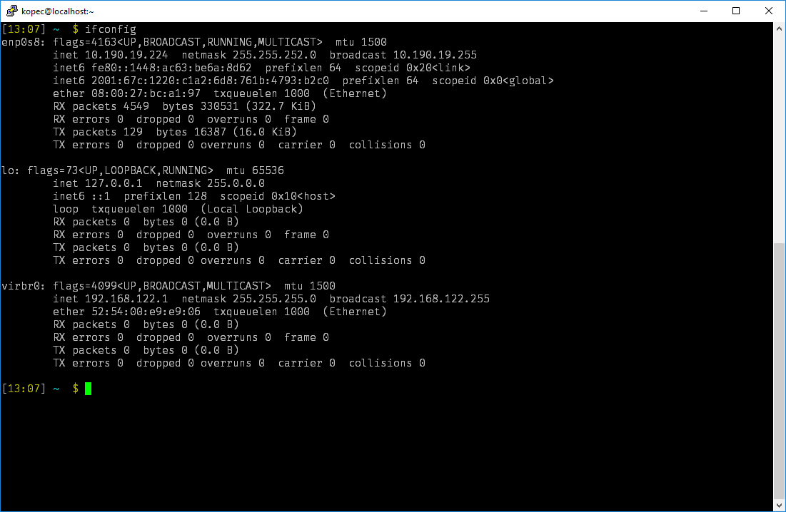

# Start linux distribution as VM in headless mode

**Dependencies** 

- [VirtualBox](https://www.virtualbox.org/wiki/Downloads)
- [Fedora Server](https://getfedora.org/en/server/download/) or any other linux distribution
- [PuTTY](http://www.putty.org/) or any other SSH client (optional)


## #1 Set up the machine

*In this part it is expected that VM machine already exists*

### Install & start ssh daemon on VM

- Install the openssh-server package
```sudo dnf install -y openssh-server```

- Start the sshd daemon (openssh-server)
```sudo systemctl start sshd.service```

- Configure the sshd daemon to start automatically at boot time
```sudo systemctl enable sshd.service```

- If you set up user without password you need to set ```PermitEmptyPasswords yes``` in ```/etc/ssh/sshd_config```

### Configure port forwarding in VirtualBox

#### NAT Adapter option

Settings --> Network  
Select **NAT** adapter  
Advanced --> Port Forwarding

Protocol | Host IP | Host Port | Guest IP | Guest Port
--- | --- | --- | --- | ---
TCP | 127.0.1.1 | 2222 | {VM Machine IP} | 22

*{VM Machine IP} - IP address on your VM, e.g. 10.0.2.15*

#### Bridged Adapter option

- Set VM network adapter to "Bridged Adapter"
- Check the IP



- ```ssh user@10.190.19.224```

## #2 Create bat file that will run on start-up

Create Windows script (```.bat``` extension) with this content:  
```
"C:\Program Files\Oracle\VirtualBox\VBoxManage.exe" startvm "{VMMachineName}" --type "headless"
```
And place it in this folder  
```
C:\Users\{username}\AppData\Roaming\Microsoft\Windows\Start Menu\Programs\Startup
```

---
*a command prompt window will display for a few moments during Windows’ initial startup sequence. Then, it will disappear and you can access your virtual machine as normal.*


---
Sources:  
https://hellojason.net/blog/automatically-launch-a-headless-virtualbox-vm-at-bootup/  
https://bytefreaks.net/gnulinux/fedora-25-install-start-enable-ssh-server  
https://unix.stackexchange.com/questions/145997/trying-to-ssh-to-local-vm-ubuntu-with-putty  
https://ask.fedoraproject.org/en/question/104352/how-to-ssh-in-a-fedora-system-using-a-user-who-has-no-set-password/
